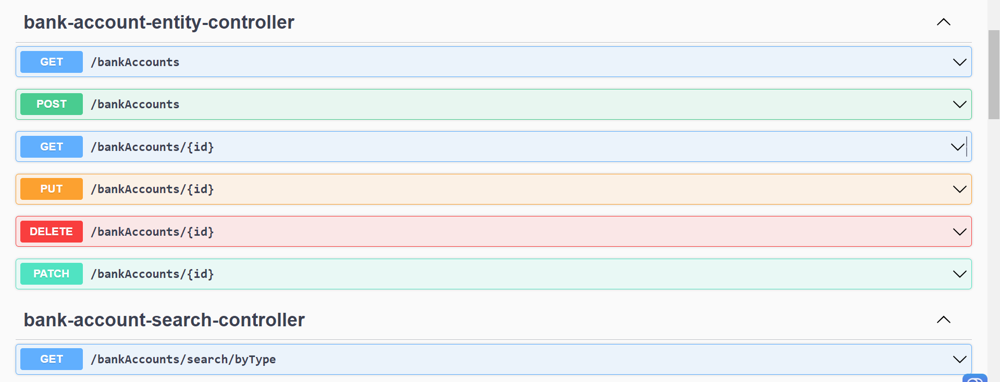
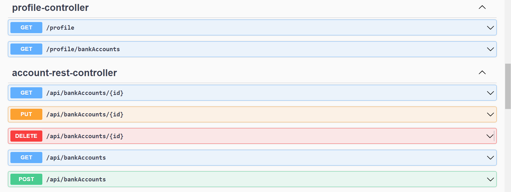
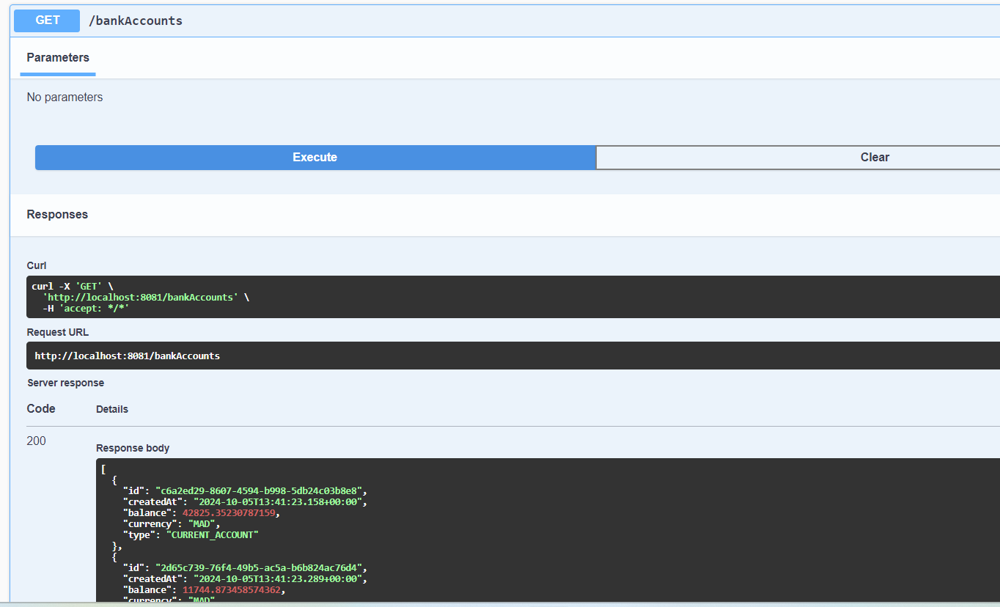
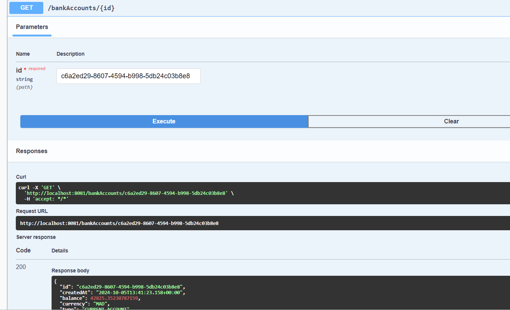
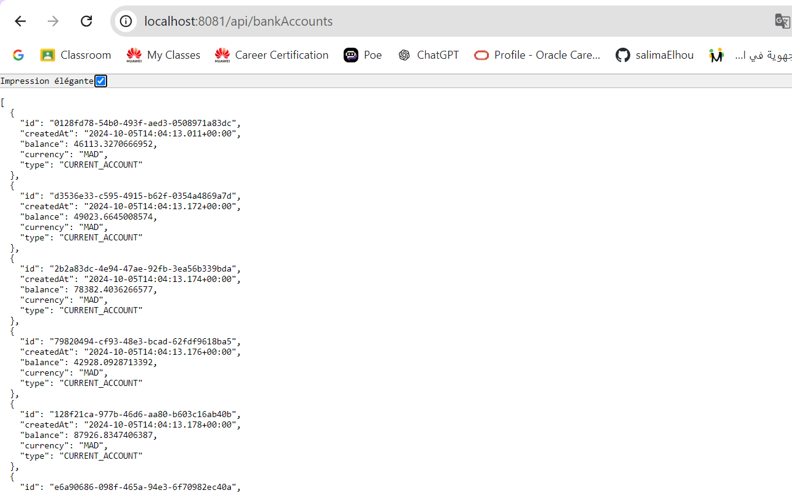
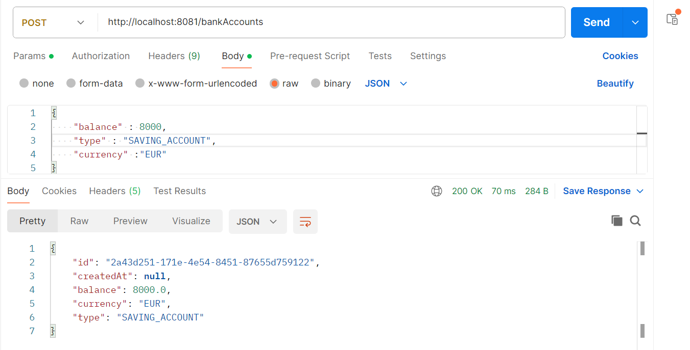
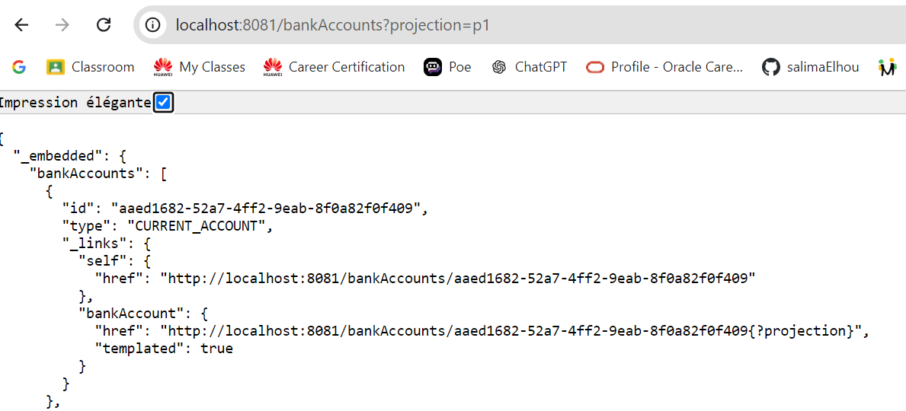
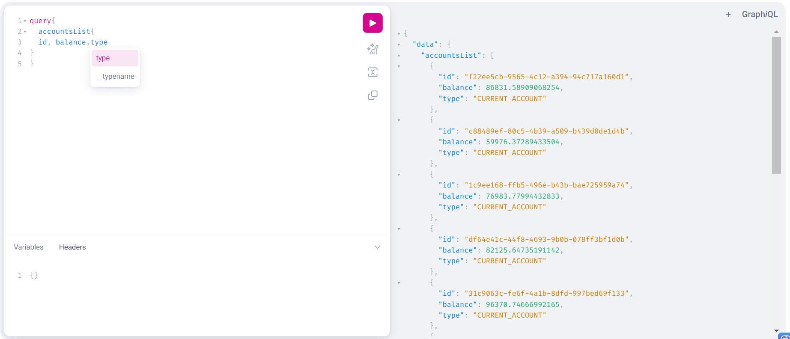
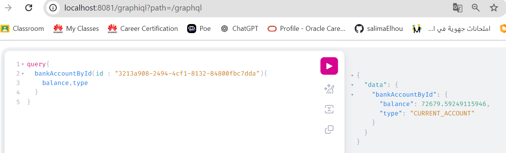

## Salima EL HOU - SDIA 2
# Développement d'un micro-service
## Les tâches réalisées

Ce projet est un micro-service de gestion des comptes bancaires permettant :
- La création, modification et suppression des comptes bancaires.
- La gestion des comptes via une API RESTful.
- L'utilisation de GraphQL pour certaines opérations spécifiques. 
- Test le web micro-service en utilisant un client REST comme Postman 
- Test le documentation Swagger de des API Rest du Web service

## Les technologies utilisées sont :
- **Spring Boot** pour la structure de l'application.
- **Spring Data JPA** pour la gestion de la base de données.
- **H2** comme base de données en mémoire.
- **Swagger** pour la documentation de l'API.
- **GraphQL** pour interroger les données avec une syntaxe spécifique.

## Back-end :
### Tests :
- Tests des opérations principales pour assurer le bon fonctionnement de l'application.

## Demo

- GraphQL

